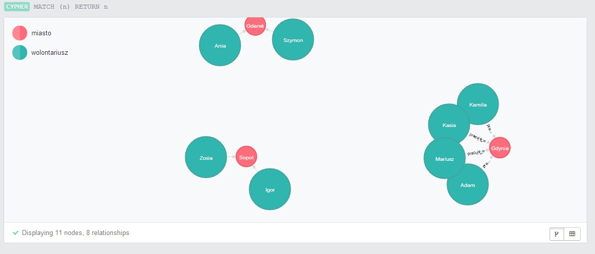
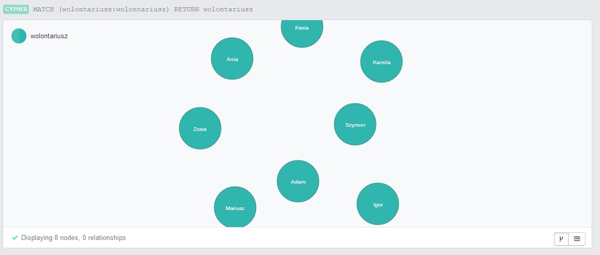
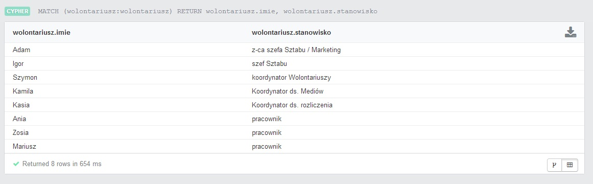
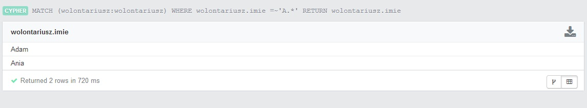
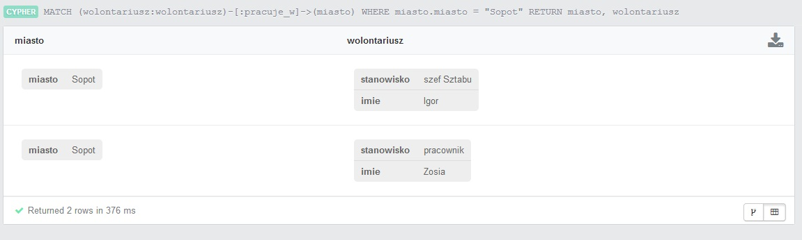

Neo4j
=====
###Moja BAZA


```

CREATE (gdansk:miasto { miasto: "Gdansk" }),
(sopot:miasto { miasto: "Sopot" }),
(gdynia:miasto { miasto: "Gdynia" })
CREATE (adam:wolontariusz { stanowisko: "z-ca szefa Sztabu / Marketing",imie: "Adam"}),
(igor:wolontariusz { stanowisko: "szef Sztabu",imie: "Igor"}),
(szymon:wolontariusz { stanowisko: "koordynator Wolontariuszy",imie: "Szymon"}),
(kamila:wolontariusz { stanowisko: "Koordynator ds. Medi?w",imie: "Kamila"}),
(kasia:wolontariusz { stanowisko: "Koordynator ds. rozliczenia",imie: "Kasia"}),
(ania:wolontariusz { stanowisko: "pracownik",imie: "Ania"}),
(zosia:wolontariusz { stanowisko: "pracownik",imie: "Zosia"}),
(mariusz:wolontariusz { stanowisko: "pracownik",imie: "Mariusz"})
CREATE (adam) -[:pracuje_w] ->(gdynia),
(igor) -[:pracuje_w] ->(sopot),
(kasia) -[:pracuje_w] ->(gdynia),
(szymon) -[:pracuje_w] ->(gdansk),
(kamila) -[:pracuje_w] ->(gdynia),
(ania) -[:pracuje_w] ->(gdansk),
(zosia) -[:pracuje_w] ->(sopot),
(mariusz) -[:pracuje_w] ->(gdynia)

```
###Wyswietlenie grafu

MATCH (n) RETURN n

```



MATCH (wolontariusz:wolontariusz)
RETURN wolontariusz

```



MATCH (wolontariusz:wolontariusz)
RETURN wolontariusz.imie, wolontariusz.stanowisko

```



MATCH (wolontariusz:wolontariusz)
WHERE wolontariusz.imie =~'A.*'
RETURN wolontariusz.imie

```



MATCH (wolontariusz:wolontariusz)-[:pracuje_w]->(miasto)
WHERE miasto.miasto = "Sopot"
RETURN miasto, wolontariusz

```



